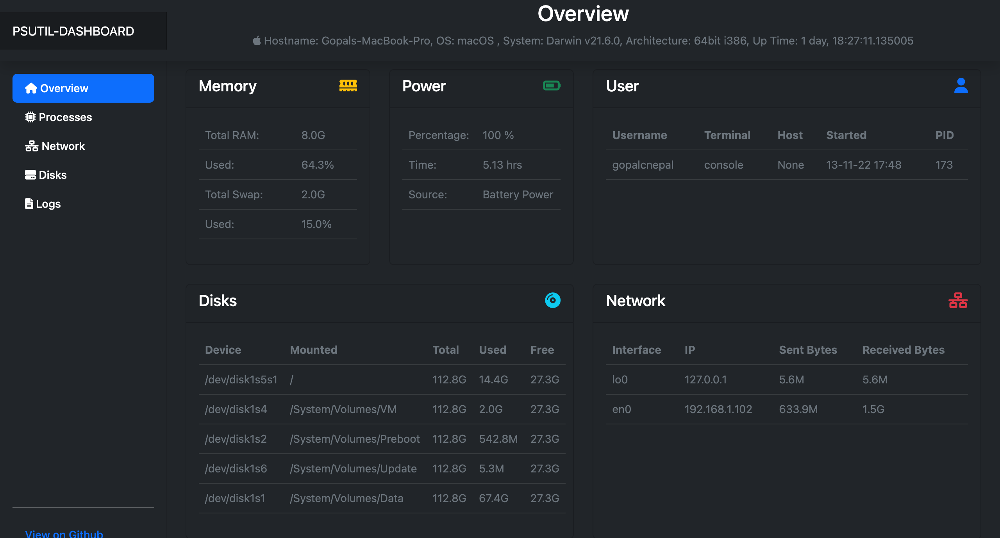
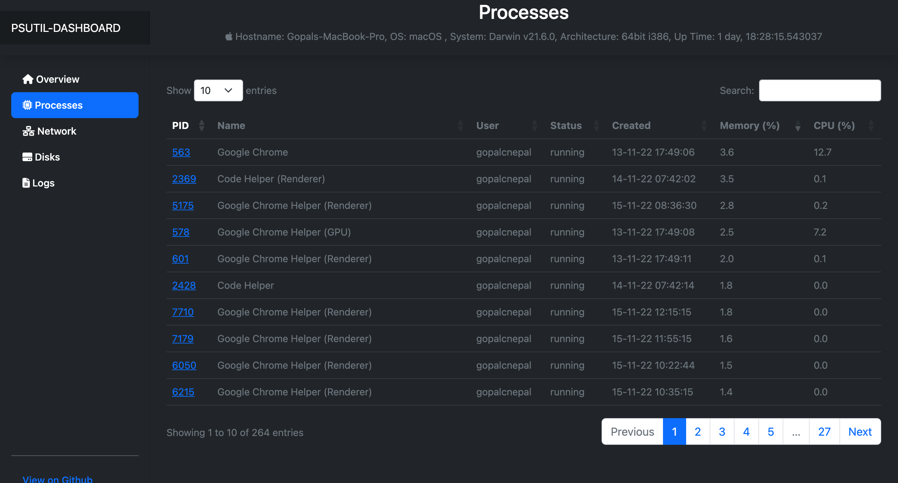

<!-- Improved compatibility of back to top link: See: https://github.com/othneildrew/Best-README-Template/pull/73 -->
<a name="readme-top"></a>
<!--
*** Thanks for checking out the Best-README-Template. If you have a suggestion
*** that would make this better, please fork the repo and create a pull request
*** or simply open an issue with the tag "enhancement".
*** Don't forget to give the project a star!
*** Thanks again! Now go create something AMAZING! :D
-->


<!-- PROJECT SHIELDS -->
<!--
*** I'm using markdown "reference style" links for readability.
*** Reference links are enclosed in brackets [ ] instead of parentheses ( ).
*** See the bottom of this document for the declaration of the reference variables
*** for contributors-url, forks-url, etc. This is an optional, concise syntax you may use.
*** https://www.markdownguide.org/basic-syntax/#reference-style-links
-->
[![Contributors][contributors-shield]][contributors-url]
[![Forks][forks-shield]][forks-url]
[![Stargazers][stars-shield]][stars-url]
[![Issues][issues-shield]][issues-url]
[![MIT License][license-shield]][license-url]
[![LinkedIn][linkedin-shield]][linkedin-url]


<!-- PROJECT LOGO -->
<br />
<div align="center">
  <a href="https://github.com/gopalcnepal/psutil-dashboard">
  </a>

<h3 align="center">PSUTIL-Dashboard</h3>

  <p align="center">
    PSUTIL based Dashboard for viewing your system information.
    <br />
    <a href="https://github.com/gopalcnepal/psutil-dashboard"><strong>Explore the docs »</strong></a>
    <br />
    <br />
    <a href="https://github.com/gopalcnepal/psutil-dashboard">View Demo</a>
    ·
    <a href="https://github.com/gopalcnepal/psutil-dashboard/issues">Report Bug</a>
    ·
    <a href="https://github.com/gopalcnepal/psutil-dashboard/issues">Request Feature</a>
  </p>
</div>


<!-- TABLE OF CONTENTS -->
<details>
  <summary>Table of Contents</summary>
  <ol>
    <li>
      <a href="#about-the-project">About The Project</a>
      <ul>
        <li><a href="#built-with">Built With</a></li>
      </ul>
    </li>
    <li>
      <a href="#getting-started">Getting Started</a>
      <ul>
        <li><a href="#prerequisites">Prerequisites</a></li>
        <li><a href="#installation">Installation</a></li>
      </ul>
    </li>
    <li><a href="#usage">Usage</a></li>
    <li><a href="#roadmap">Roadmap</a></li>
    <li><a href="#screenshot">Screenshot</a></li>
    <li><a href="#contributing">Contributing</a></li>
    <li><a href="#license">License</a></li>
    <li><a href="#contact">Contact</a></li>
    <li><a href="#acknowledgments">Acknowledgments</a></li>
  </ol>
</details>


<!-- ABOUT THE PROJECT -->
## About The Project

[![PSUTIL Dashboard][product-screenshot]](https://github.com/gopalcnepal/psutil-dashboard)

This is a fun project that I have started to learn Flask. In this project I will combine the power of psutil module to extrct the system information and display in the dashboard.

This Project is test only on macOS Monterey. However the aim of project is to make it compaitable to run on any OS.

<p align="right">(<a href="#readme-top">back to top</a>)</p>


### Built With

* [Python](https://www.python.org/)
* [Bootstrap][Bootstrap-url]
* [psutil](https://github.com/giampaolo/psutil)
* [flask](https://flask.palletsprojects.com/)

<p align="right">(<a href="#readme-top">back to top</a>)</p>


<!-- GETTING STARTED -->
## Getting Started

To get a local copy up and running follow these simple example steps.

### Prerequisites

This is an example of how to list things you need to use the software and how to install them.
* Download and install Python for your system [https://www.python.org/](https://www.python.org/)

### Installation

1. Clone the repo
   ```sh
   git clone https://github.com/gopalcnepal/psutil-dashboard.git
   ```
2. Navigate to the project directory

3. Install Python packages
   ```sh
   pip install -r requirements.txt
   ```

<p align="right">(<a href="#readme-top">back to top</a>)</p>


<!-- ROADMAP -->
## Roadmap

- [x] System Information
- [x] Hard Drive Information
- [x] Power Information
- [x] Memory Information
- [x] User Processes 

See the [open issues](https://github.com/gopalcnepal/psutil-dashboard/issues) for a full list of proposed features (and known issues).

<p align="right">(<a href="#readme-top">back to top</a>)</p>

<!-- SCREENSHOT -->
## Screenshot





<p align="right">(<a href="#readme-top">back to top</a>)</p>


<!-- CONTRIBUTING -->
## Contributing

Contributions are what make the open source community such an amazing place to learn, inspire, and create. Any contributions you make are **greatly appreciated**.

If you have a suggestion that would make this better, please fork the repo and create a pull request. You can also simply open an issue with the tag "enhancement".
Don't forget to give the project a star! Thanks again!

1. Fork the Project
2. Create your Feature Branch (`git checkout -b feature/AmazingFeature`)
3. Commit your Changes (`git commit -m 'Add some AmazingFeature'`)
4. Push to the Branch (`git push origin feature/AmazingFeature`)
5. Open a Pull Request

<p align="right">(<a href="#readme-top">back to top</a>)</p>


<!-- LICENSE -->
## License

Distributed under the MIT License. See `LICENSE.txt` for more information.

<p align="right">(<a href="#readme-top">back to top</a>)</p>


<!-- ACKNOWLEDGMENTS -->
## Acknowledgments

Following resources have helped me get inspired and ideas to build this project.
* [psdash](https://github.com/Jahaja/psdash)
* [Bootstrap Template](https://getbootstrap.com/docs/5.2/examples/dashboard/)
* [Fontawesome](https://fontawesome.com/)
* [Readme Template](https://github.com/othneildrew/Best-README-Template)

<p align="right">(<a href="#readme-top">back to top</a>)</p>


<!-- MARKDOWN LINKS & IMAGES -->
<!-- https://www.markdownguide.org/basic-syntax/#reference-style-links -->
[product-screenshot]: screenshot/psutil_dashboard.png
[contributors-shield]: https://img.shields.io/github/contributors/gopalcnepal/psutil-dashboard.svg?style=for-the-badge
[contributors-url]: https://github.com/gopalcnepal/psutil-dashboard/graphs/contributors
[forks-shield]: https://img.shields.io/github/forks/gopalcnepal/psutil-dashboard.svg?style=for-the-badge
[forks-url]: https://github.com/gopalcnepal/psutil-dashboard/network/members
[stars-shield]: https://img.shields.io/github/stars/gopalcnepal/psutil-dashboard.svg?style=for-the-badge
[stars-url]: https://github.com/gopalcnepal/psutil-dashboard/stargazers
[issues-shield]: https://img.shields.io/github/issues/gopalcnepal/psutil-dashboard.svg?style=for-the-badge
[issues-url]: https://github.com/gopalcnepal/psutil-dashboard/issues
[license-shield]: https://img.shields.io/github/license/gopalcnepal/psutil-dashboard.svg?style=for-the-badge
[license-url]: https://github.com/gopalcnepal/psutil-dashboard/blob/master/LICENSE.txt
[linkedin-shield]: https://img.shields.io/badge/-LinkedIn-black.svg?style=for-the-badge&logo=linkedin&colorB=555
[linkedin-url]: https://linkedin.com/in/gopalcnepal
[Bootstrap.com]: https://img.shields.io/badge/Bootstrap-563D7C?style=for-the-badge&logo=bootstrap&logoColor=white
[Bootstrap-url]: https://getbootstrap.com